<p align="center">
  <h1 align="center">🧠 Exact Linear Attention (ELA)</h1>
  <p align="center">
    <em>Exact $O(L)$ Attention — No Approximation, No Compromise</em>
  </p>
  <p align="center">
    <a href="https://arxiv.org/abs/"></a>
    <a href="LICENSE"></a>
    
    
    
    
    <br>
    
    <a href="https://github.com/yauntyour/Exact-Linear-Attention/issues"></a>
    <a href="https://github.com/yauntyour/Exact-Linear-Attention/forks"></a>
  </p>
</p>

---

## Abstract

This paper introduces **Exact Linear Attention (ELA)**, a mechanism that achieves linear computational complexity for Transformer attention by leveraging the exact decomposition property of kernel functions, **without any approximation error**. The work identifies and addresses two key limitations of prior linear attention—gradient explosion and token attention dilution—by imposing kernel constraints that ensure non-negativity, discriminability, and geometric interpretability. Several kernel functions are proposed, including the **Hadamard Exp Kernel**, **Summation Squared Euclidean Distance Kernel**, and **Subtraction Squared Euclidean Distance Kernel**, each tailored for specific attention behaviors.

Beyond the core attention formulation, the paper presents three engineering innovations: (1) a **Hyper-Link** structure that replaces traditional residual connections to mitigate gradient degradation; (2) a **Memory Lobe** module based on bidirectional linear attention, which captures "transformation flow" across layers to implement qualitative memory and an implicit reinforcement learning paradigm; and (3) a routing-score-based bias mechanism for **Mixture-of-Experts (MoE)** to improve interpretability and semantic alignment.

Experimental results demonstrate that ELA achieves up to **6× faster decoding speed** and **75% reduction in KV cache memory usage** compared to full attention, while maintaining comparable or superior training performance.

---

## Table of Contents

- [Introduction](#introduction)
- [Kernel Functions](#kernel-functions)
- [Exact Linear Attention Formulation](#exact-linear-attention-formulation)
- [Custom Kernel Construction](#custom-kernel-construction)
- [Engineering Contributions](#engineering-contributions)
  - [FFN \& MoE Interpretability](#ffn--moe-interpretability)
  - [Hyper-Link](#hyper-link)
  - [Memory Lobe (Transformation Flow)](#memory-lobe-transformation-flow)
- [Experiments](#experiments)
  - [No Memory Training Comparison](#no-memory-training-comparison)
  - [Memory Additional](#memory-additional)
  - [Long-Range Training](#long-range-training)
- [Citation](#citation)
- [References](#references)

---

## Introduction

Linear attention has long been considered a promising direction for scaling Transformers to long sequences. Inspired by the studies of linear attention from Katharopoulos' group and Jürgen Schmidhuber's team, this paper formally presents an exact linear attention mechanism. It exploits the exact decomposition property of kernels, departing from the traditional approximate softmax paradigm.

After systematically analyzing the limitations of linear attention, the MiniMax Team identified two key issues: **gradient explosion** induced by denominator-caused unbounded gradients, and **token attention dilution** in linear attention. Targeting these defects, we propose a linearized full attention computation approach, which bounds gradients by imposing kernel constraints and exploits the inherent favorable properties of kernels.

By breaking the $O(L^2)$ computational bottleneck of conventional attention, linear attention enables dramatic improvements in computational efficiency. Based on empirical results from teams including Kimi and MiniMax, this theoretical complexity gap manifests as a substantial performance disparity in practice:

- **Inference Speed**: For ultra-long text (e.g., 1M tokens), the decoding speed of linear attention exceeds that of full global attention by **more than six times**. In a 1M context test, Kimi Linear achieves a TPOT of merely 1.84 ms, while traditional architectures such as MLA reach as high as 11.48 ms.
- **Memory Usage (KV Cache)**: Linear attention reduces the KV Cache memory footprint by **75%–90%**.

With identical GPU resources, linear attention models can process much longer documents or serve more concurrent users. For instance, MiniMax's model leverages linear attention to support a context window of up to **4 million tokens**, a scale prohibitively costly for conventional full-attention architectures.

<p align="center">
  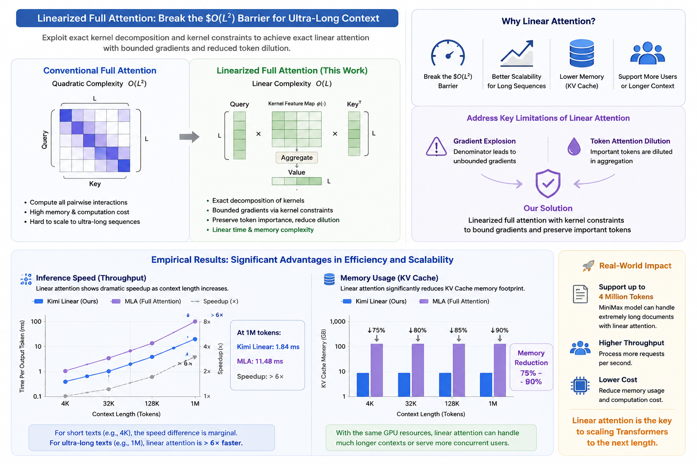
</p>

---

## Kernel Functions

### Desirable Properties

To address the inherent limitations of linear attention, an ideal kernel function should possess:

- ✅ **Exactly decomposable** — admits an expansion that factors into separate query/key feature maps (per Mercer's theorem)
- ✅ **Sufficiently discriminative** — smooth, broad output range to avoid gradient vanishing/explosion
- ✅ **Non-negative** — guarantees all attention weights are non-negative
- ✅ **Geometrically interpretable** — clear meaning in the embedding space

Through systematic summarization, kernel functions satisfying these requirements can be divided into: Polynomial type, exponential type, non-negative periodic function type, and absolute value function type. Given the demand for favorable discriminability and nonlinear characteristics, the **Hadamard Exp Kernel** stands out as the optimal choice.

The following kernel functions possess distinct geometric interpretability:

| Kernel | Expression | Behavior |
|--------|-----------|----------|
| **Summation Squared Euclidean Distance** | $\|A_i + B_j\|^2 = \|A\|^2 + \|B\|^2 + 2A_i\cdot B_j$ | Emphasizes keys **aligned** with the query (supporting evidence) |
| **Subtraction Squared Euclidean Distance** | $\|A_i - B_j\|^2 = \|A\|^2 + \|B\|^2 - 2A_i\cdot B_j$ | Emphasizes keys **opposite** to the query (contrastive learning) |
| **Hadamard Exp Kernel** 🌟 | $k(A_i,B_j) = \exp(A_i) \ast \exp(B_j) = \sum_{d=1}^{D} \exp(A_{id})\exp(B_{jd})$ | Amplifies feature **co-activation** patterns (multimodal, noise-robust) |

> 🌟 **The Hadamard Exp Kernel is recommended as the default choice** due to its strong nonlinearity, exact decomposability, smoothness, and non-negativity. Compared with the cosine-similarity-based paradigm of conventional attention, it captures feature co-activation patterns in a more discriminative manner, especially suitable for multimodal scenarios.

---

## Exact Linear Attention Formulation

By virtue of Mercer's theorem, any positive definite kernel admits a decomposition as an inner product within a feature space:

$$k(A_i, B_j) = \phi(A_i)\psi(B_j)^\top$$

The decompositions of our kernel functions:

- **Summation Squared Euclidean Distance Kernel**

  $$\phi(A_i) = \begin{pmatrix} A_i \\ \|A_i\|^2 \\ 1 \end{pmatrix} \in \mathbb{R}^{D+2},\quad
   \psi(B_j) = \begin{pmatrix} 2B_j \\ 1 \\ \|B_j\|^2 \end{pmatrix} \in \mathbb{R}^{D+2}$$

- **Subtraction Squared Euclidean Distance Kernel**

  $$\phi(A_i) = \begin{pmatrix} A_i \\ \|A_i\|^2 \\ 1 \end{pmatrix} \in \mathbb{R}^{D+2},\quad
   \psi(B_j) = \begin{pmatrix} -2B_j \\ 1 \\ \|B_j\|^2 \end{pmatrix} \in \mathbb{R}^{D+2}$$

- **Hadamard Exp Kernel**

  $$\phi(A_i) = \begin{pmatrix} \exp(A_{i1}) \\ \vdots \\ \exp(A_{iD}) \end{pmatrix} \in \mathbb{R}^{D},\quad
   \psi(B_j) = \begin{pmatrix} \exp(B_{j1}) \\ \vdots \\ \exp(B_{jD}) \end{pmatrix} \in \mathbb{R}^{D}$$

The exact decomposition allows swapping computation order to achieve linear complexity **without any loss of precision**:

$$k(A_i, B_j)V_j = \phi(A_i) \psi(B_j)^\top V_j = \phi(A_i)\,[\psi(B_j)^\top V_j]$$

After row normalization:

$$\frac{\sum_{j=1}^{L} k(A_i, B_j)V_j}{\sum_{j=1}^{L} k(A_i, B_j)} = \frac{\phi(A_i)\bigl[\sum_{j=1}^{L}\psi(B_j)^\top V_j\bigr]}{\phi(A_i)\sum_{j=1}^{L}\psi(B_j)^\top}$$

### Optimization Strategies

**Bidirectional Attention:**

$$C = \sum_{j=1}^{L} \psi(B_j), \qquad
  S = \sum_{j=1}^{L} \psi(B_j) V_j^\top, \qquad
  Y_i = \frac{\phi(A_i)^\top S}{\phi(A_i)^\top C}$$

**Causal (Auto-Regressive) Attention:**

$$C_i = \sum_{j=1}^{i} \psi(B_j), \qquad
  S_i = \sum_{j=1}^{i} \psi(B_j) V_j^\top, \qquad
  Y_i = \frac{\phi(A_i)^\top S_i}{\phi(A_i)^\top C_i}$$

By swapping the order of summation, the bidirectional version requires only a single accumulation over the sequence, and the causal version uses a prefix sum (cumulative sum). In both cases the entire attention output is computed in **$O(L)$** time without ever materializing the $L \times L$ attention matrix.

---

## Custom Kernel Construction

Based on the four criteria proposed, you can freely design a kernel function tailored to your specific task. For example, to restore standard attention properties:

$$k(A_i, B_j) = (\vec{A}_i \cdot \vec{B}_j + 1) \cdot (\|A_i\|^2 + 1) \cdot (\|B_j\|^2 + 1)$$

$$\phi(A_i) = (\|A_i\|^2 + 1)\begin{pmatrix} \vec{A}_i \\ 1 \end{pmatrix},\quad
  \psi(B_j) = (\|B_j\|^2 + 1)\begin{pmatrix} \vec{B}_j \\ 1 \end{pmatrix}$$

Here, $\vec{A}_i \cdot \vec{B}_j + 1$ captures attention to directional information, while $(\|A_i\|^2 + 1) \cdot (\|B_j\|^2 + 1)$ accounts for attention to magnitude information.

---

## Engineering Contributions

### FFN & MoE Interpretability

To address the "black-box" problem of FFN and the interpretability challenge of MoE routing, we propose assigning each expert network a fixed, learnable **label vector**, aggregated into a unified key representation. The routing score is then used as the bias term of the expert network, with two implementation variants:

$$X_t = S_e * ffn(X_{t-1})+B_e$$
$$X_t = S_e * (ffn(X_{t-1}) + B_e)$$

Regardless of the type of bias adopted, its performance is consistently better than the bias-free counterpart.

<p align="center">
  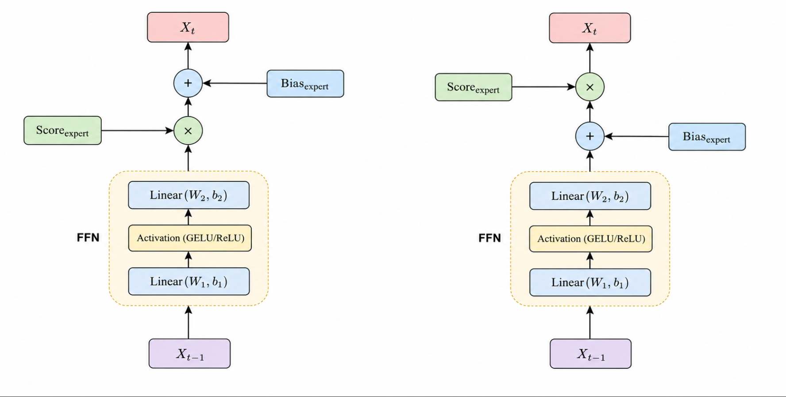
</p>

**FFN Bias Ablation Study:**

| Model | Inner Bias | Outer Bias | Without Bias |
|-------|-----------|------------|-------------|
| **ELA-GPT** | 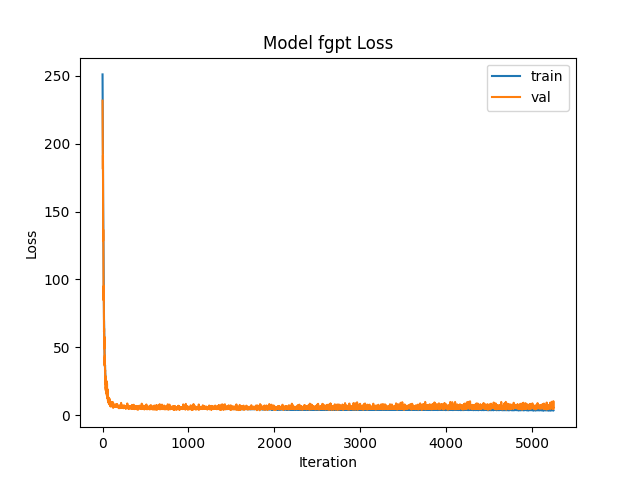 | 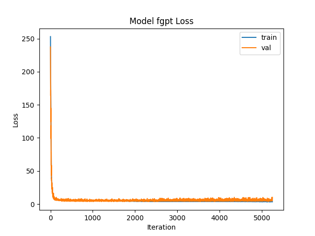 | 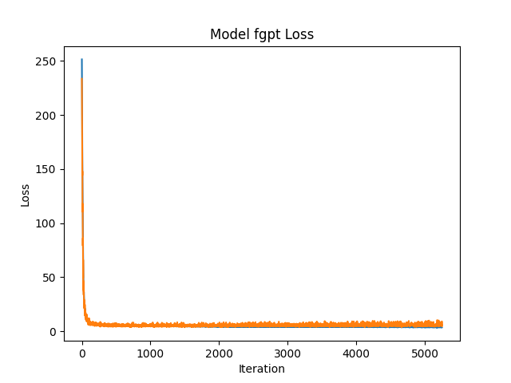 |
| **FA-GPT** | 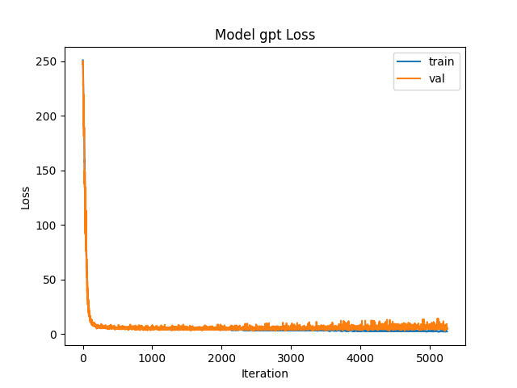 | 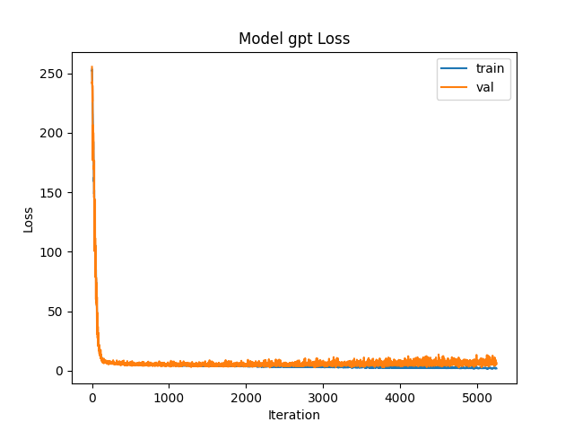 | 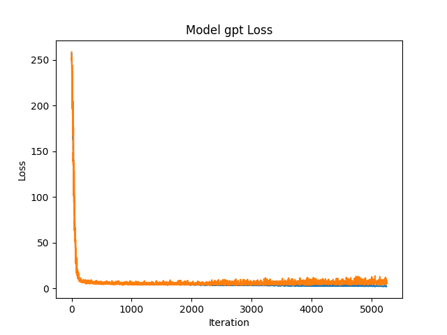 |

### Hyper-Link

We propose to reconstruct the residual pathway: we establish residual connections between Decoder layers at different depths and remove the attention residual branch in the standard Pre-Norm architecture, treating the entire Transformer layer as an integrated whole. Furthermore, the gated FFN outputs are leveraged to adaptively modulate the signal of each layer.

<p align="center">
  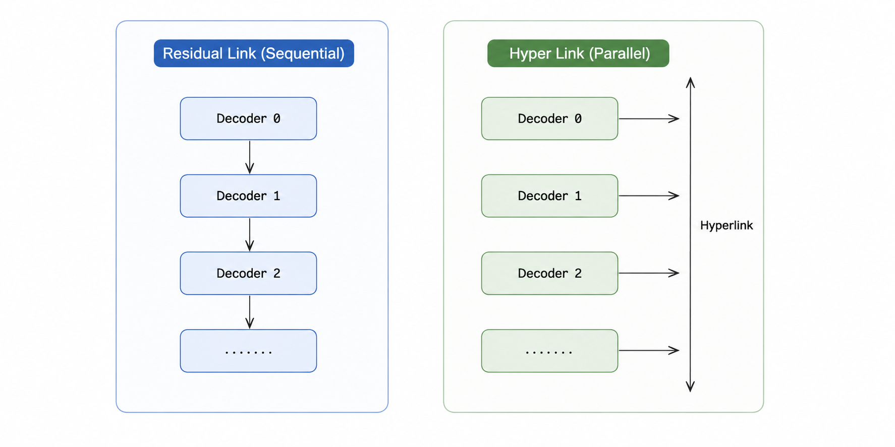
</p>

**Training Comparison (GPT):**

| Hyper-Link | Normal |
|-----------|--------|
|  | 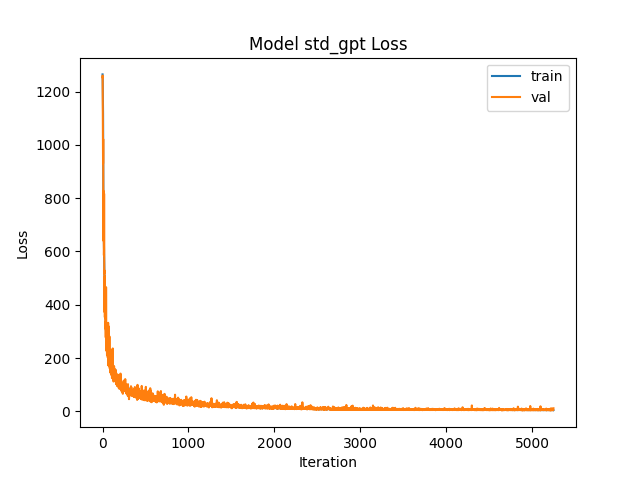 |

Experimental results demonstrate that our method effectively accelerates training speed and substantially mitigates gradient degradation.

### Memory Lobe (Transformation Flow)

Inspired by biological neural memory systems, we distinguish two forms of memory:

- **Factual memory** — records that an event occurred (background knowledge)
- **Qualitative memory** — represents how an event is perceived or evaluated (behavioral judgment and rules)

We define the **transformation flow** as the discrete differentiation across layers:

$$\Delta X_{k|k-1} = X_{k} - X_{k-1} = ffn(attn(RMSnorm(X_{k-1})))$$

A bidirectional attention-based perception module processes this "Flow":

```python
def lob(dx):
    q = Q(dx)
    k = K(dx)
    v = V(dx)
    return ELA(q, k, v)  # Bidirectional Linear Attention

def decoder(x):
    x_norm = norm(x)
    attn = ELA_causal(query=x_norm, key=x_norm, value=x_norm)
    ffn_out, aux_loss = MoE(attn)
    lob_out = lob(ffn_out)
    return x + ffn_out + lob_out, aux_loss
```

This is a mathematical formulation of **qualitative memory** — the QKV weight matrices of bidirectional attention can "memorize" which representations lead to lower loss during training. Although the training process appears as explicit supervised learning, it essentially implements an implicit reinforcement learning paradigm — the "Action-Reward" mechanism: the current memory query serves as the **Action**, and its direct contribution to the loss acts as the corresponding **Reward**.

The QKV weight matrices of this memory module are **pluggable** and can be embedded into any semantic-transformation-based model, providing a new paradigm for LLM training beyond **LoRA** and **Engram** methods.

---

## Experiments

**Experimental Setup:** To unify variables, all attention kernels involved adopt the same type. Two models are built for ablation validation. The training dataset contains 129×3500 samples (451,500 tokens). We adopt the Minimind tokenizer with vocabulary size V=6400. The model architecture uses L=4 Transformer layers, model dimension d_model=256, n_heads=4, with MoE (n_experts=4). Total parameters: 5,838,864. Training with 30 epochs.

We separately train FA-GPT with standard MoE, as well as ELA-GPT variants equipped with the Hadamard Exp Kernel and the Summation Squared Euclidean Distance Kernel.

### No Memory Training Comparison

<p align="center">
  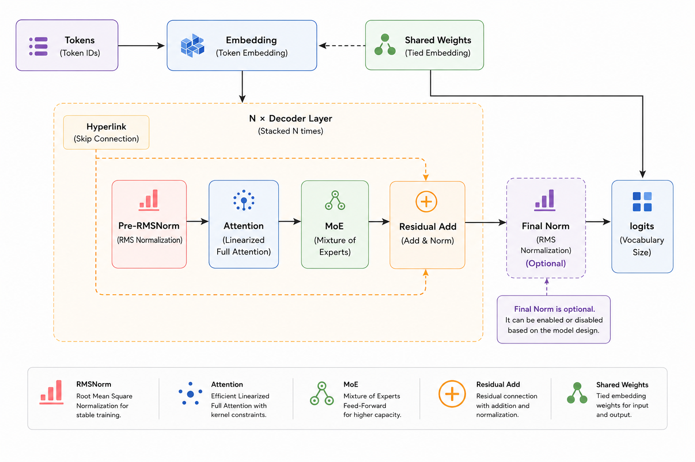
</p>

**Training Comparison (Hyper-Link):**

| $\|A_i+B_j\|^2$ | $\exp(A_i)\exp(B_j)$ | Full |
|:---:|:---:|:---:|
| 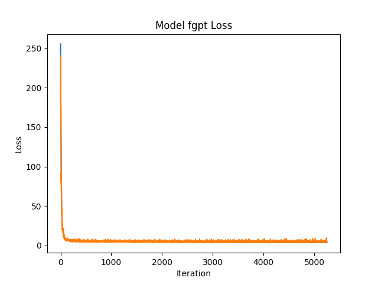 |  |  |

**Training Comparison (Normal):**

| $\|A_i+B_j\|^2$ | $\exp(A_i)\exp(B_j)$ | Full |
|:---:|:---:|:---:|
| 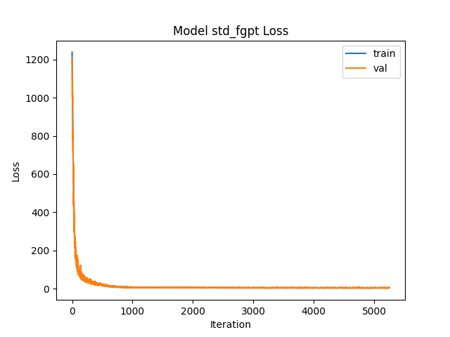 |  |  |

The two models exhibit negligible differences in training performance. In particular, the ELA variant shows a **slight advantage in anti-overfitting ability**.

### Memory Additional

After integrating the Memory module, the model achieves faster loss convergence. On the vanilla GPT, an abrupt loss drop with an inflection point at around the 750th training step is observed (global steps, 10 epochs totaling 1750 steps). When a causal mask is applied to the Memory Query of the vanilla GPT, this abrupt drop vanishes completely.

| $\exp(A_i)\exp(B_j)$ + Memory | Full + Memory | Full + Memory (Causal) |
|:---:|:---:|:---:|
| 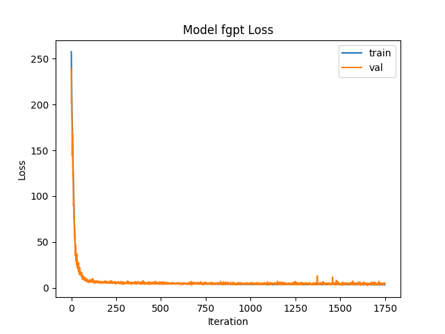 | 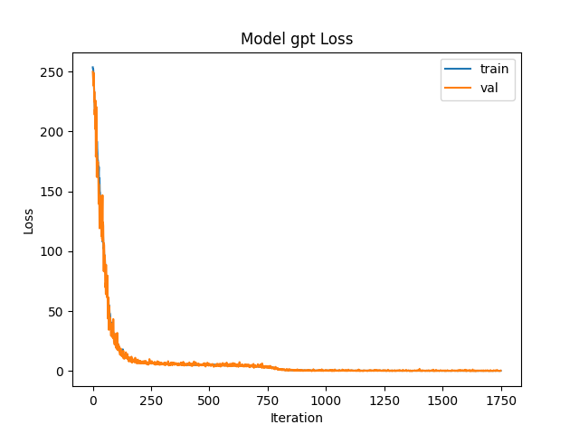 | 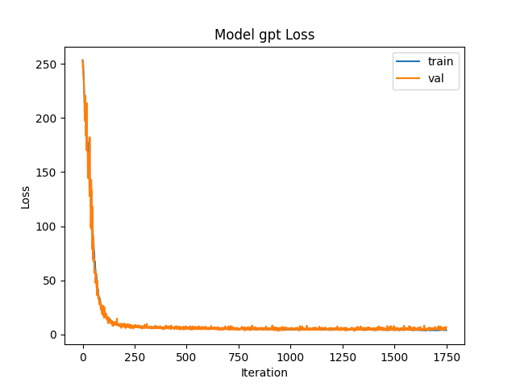 |

**Key findings:**
- Datasets that originally required **30 epochs** for convergence only need around **10 epochs** after integrating the memory module
- Training loss and validation loss become much more consistent
- The non-embedding parameters increase to 6,624,272 after introducing the memory module

### Long-Range Training

In long-range training, ELA maintains stable convergence.

<p align="center">
  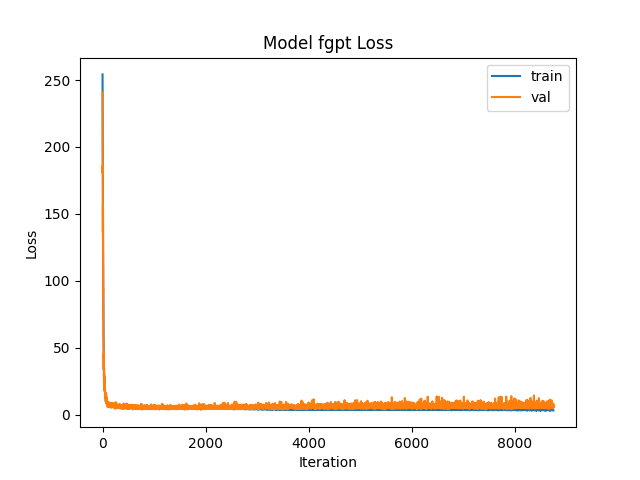
</p>

---

## Citation

```bibtex
@article{exactlinearattention2026,
  title={Exact Linear Attention: Achieving O(L) Complexity Without Approximation},
  author={Yuntian Yao},
  journal={arXiv preprint},
  year={2026}
}
```

---

## References

| Year | Work | Venue |
|------|------|-------|
| 1909 | Mercer, *"Functions of Positive and Negative Type, and Their Connection with the Theory of Integral Equations"* | Phil. Trans. R. Soc. Lond. A |
| 2008 | Polyn & Kahana, *"Memory Search and the Neural Representation of Context"* | Trends in Cognitive Sciences |
| 2010 | Buschman & Miller, *"Goal-Direction and Top-Down Control"* | Phil. Trans. R. Soc. B |
| 2017 | Vaswani et al., *"Attention Is All You Need"* | NeurIPS |
| 2018 | Zhang et al., *"Memory Contextualization: The Role of the Left Inferior Frontal Gyrus"* | J. Cognitive Neuroscience |
| 2019 | Jain & Wallace, *"Attention is not Explanation"* | NAACL-HLT |
| 2020 | Katharopoulos et al., *"Transformers are RNNs: Fast Autoregressive Transformers with Linear Attention"* | ICML |
| 2020 | Jia et al., *"Efficient Large-Scale Language Model Training on GPU Clusters Using Megatron-LM"* | SC'20 |
| 2021 | Schlag, Irie & Schmidhuber, *"Linear Transformers Are Secretly Fast Weight Programmers"* | ICML |
| 2022 | Qin et al., *"The Devil in Linear Transformer"* | EMNLP |
| 2024 | Zhu et al., *"Hyper-Connections"* | arXiv |
| 2025 | MiniMax Team, *"MiniMax-01: Scaling Foundation Models with Lightning Attention"* | arXiv |
| 2025 | Kimi Team, *"Kimi Linear: A Novel Hybrid Linear Attention Architecture"* | arXiv |
| 2025 | Xie et al., *"mHC: Manifold-Constrained Hyper-Connections"* | arXiv |
| 2026 | Cheng et al., *"Conditional Memory via Scalable Lookup: A New Axis of Sparsity for Large Language Models"* | arXiv |
| 2026 | Jingyao, *"MiniMind: Train a Tiny LLM from Scratch"* | GitHub |
| 2026 | de Sousa et al., *"The Prefrontal Cortex Controls Memory Organization in the Hippocampus"* | Nature Neuroscience |

---

<p align="center">
  <a href="#-exact-linear-attention-ela">⬆ Back to Top</a>
</p>
