# Exact Linear Attention

## Table of Contents

- [1. Introduction](#1-introduction)
- [2. Regarding Which Kernel Function is Suitable for This Task](#2-regarding-which-kernel-function-is-suitable-for-this-task)
- [3. Exact Linear Attention Formulation](#3-exact-linear-attention-formulation)
- [4. How to Construct Your Own Attention Kernel](#4-how-to-construct-your-own-attention-kernel)
- [5. Challenges in Engineering Construction](#5-challenges-in-engineering-construction)
  - [5.1 The Dilemma of FFN](#51-the-dilemma-of-ffn)
  - [5.2 Hyperlink-Based Residual Replacement for Degradation Eradication](#52-hyperlink-based-residual-replacement-for-degradation-eradication)
  - [5.3 How Memory Works](#53-how-memory-works)
- [6. Experiments](#6-experiments)
  - [6.1 No Memory Training Comparison](#61-no-memory-training-comparison)
  - [6.2 Memory Additional](#62-memory-additional)
  - [6.3 Long-range Training](#63-long-range-training)
- [7. Extend to Vision Models](#7-extend-to-vision-models)
- [8. Exploratory Works](#8-exploratory-works)
- [Acknowledgments](#acknowledgments)
- [References](#references)

---

## 1. Introduction

Linear attention has long been considered a promising direction for scaling Transformers to long sequences.

Inspired by the studies of linear attention [(Katharopoulos et al., 2020)](#ref-katharopoulos2020) [(Schlag et al., 2021)](#ref-schlag2021) from Katharopoulos' group and Jürgen Schmidhuber's team, this paper formally presents an exact linear attention mechanism. It exploits the exact decomposition property of kernels, departing from the traditional approximate softmax paradigm.

Meanwhile, after systematically analyzing the limitations of linear attention, the MiniMax Team identified two key issues: gradient explosion induced by denominator-caused unbounded gradients, and token attention dilution in linear attention [(Qin et al., 2022)](#ref-qin2022). Targeting these defects, we propose a linearized full attention computation approach, which bounds gradients by imposing kernel constraints and exploits the inherent favorable properties of kernels. This work offers a new perspective to resolve the inherent limitations of linear attention.

By breaking the $O(L^2)$ computational bottleneck of conventional attention, linear attention enables dramatic improvements in computational efficiency without the need for sampling. When the context length increases by one order of magnitude, the performance gap between linear and conventional attention widens correspondingly. Consequently, linearized attention will continue to be an essential research pursuit for Transformer-style attention networks [(Vaswani et al., 2017)](#ref-vaswani2017) over the long term.

Based on empirical results from teams including Kimi Linear (The Dark Side of the Moon) [(Kimi Team, 2025)](#ref-kimilinear2025) and MiniMax [(MiniMax Team, 2025)](#ref-minimax2025lightning), this theoretical complexity gap manifests as a substantial performance disparity in practical applications:

- **Inference Speed (Throughput):** For short texts (e.g., 4k context length), the speed difference between the two approaches is marginal, and linear attention may even be slightly slower due to operator optimization limitations. In ultra-long text scenarios (e.g., 1M tokens), the decoding speed of linear attention exceeds that of full global attention by more than six times. In a 1M context test, Kimi Linear achieves a Time Per Output Token (TPOT) of merely 1.84 ms, while traditional architectures such as MLA reach as high as 11.48 ms.
- **Memory Usage (KV Cache):** Linear attention reduces the KV Cache memory footprint by 75%–90%.

This indicates that with identical GPU resources, linear attention models can process much longer documents or serve more concurrent users with a larger batch size. For instance, MiniMax's model leverages linear attention to support a context window of up to 4 million tokens, a scale that is prohibitively costly for conventional full-attention architectures.

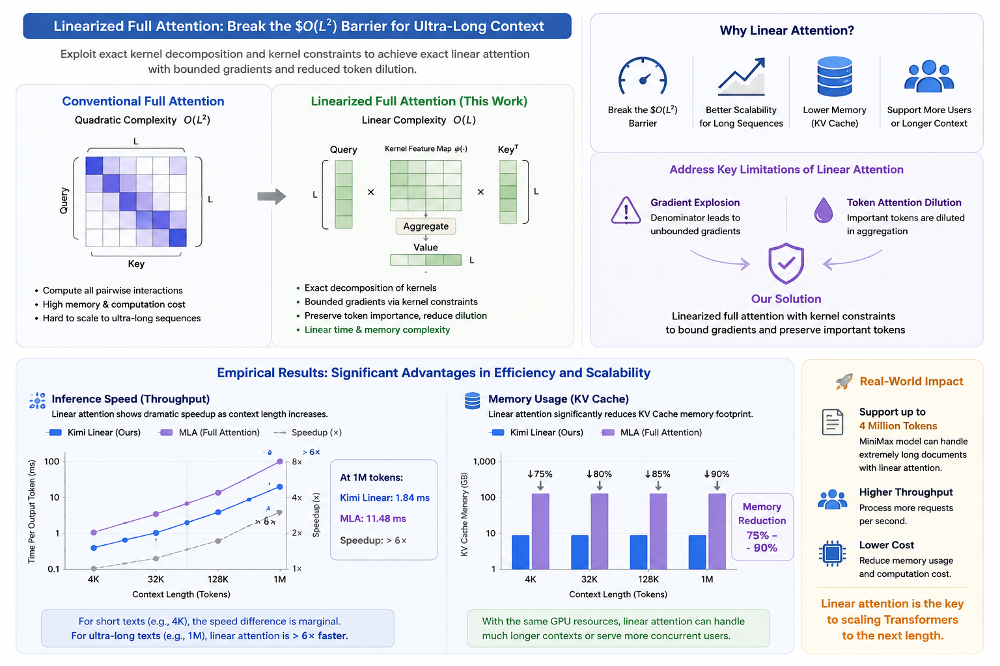

---

## 2. Regarding Which Kernel Function is Suitable for This Task

To address the inherent limitations of linear attention, we summarize the desirable properties that an ideal kernel function should possess.

- **Exactly decomposable** — A kernel function shall have the inherent property to admit expansions of adequate accuracy.
- **Sufficiently discriminative** — The output curve is expected to possess prominent discriminability along with a smooth and broad value range, thereby mitigating the issues of gradient vanishing and gradient explosion.
- **Non‑negative** — Guaranteeing that all attention matrix weights are non‑negative.
- **Geometrically interpretable** — The kernel ought to possess a clear geometric interpretation in the embedding space, so as to enhance the internal interpretability of the model.

The above points cover the most fundamental characteristics required for attention computation. Exact decomposability guarantees the precision of attention calculation; sufficient discriminability ensures that the resulting attention matrix will not be diluted after normalization. Meanwhile, non-negativity and geometric interpretability serve as the basic prerequisites for attention models.

Through systematic summarization and induction, we find that kernel functions satisfying the requirements can be roughly divided into the following categories: Polynomial type, exponential type, non-negative periodic function type, and absolute value function type.

Given the demand for favorable discriminability and nonlinear characteristics, the Hadamard Exp Kernel stands out as an optimal choice for the following reasons:

1. It is exactly decomposable and maintains a relatively low computational complexity.
2. The exponential transformation provides strong nonlinearity and enhances feature selectivity.
3. It is fully smooth and differentiable everywhere.
4. It guarantees non-negativity of attention weights.

These desirable properties allow us to easily associate the essence of attention — query-based cosine-like similarity — and thereby recognize that the following kernel functions possess distinct geometric interpretability.

- **Summation Squared Euclidean Distance Kernel:** Its attention mechanism emphasizes keys that are aligned in the same direction as the query. For example, it retrieves supporting evidence in question answering, namely contextual content consistent with the query direction.

  $$\|A_i + B_j\|^2 = \|A\|^2 + \|B\|^2 + 2A_i\cdot B_j$$

- **Subtraction Squared Euclidean Distance Kernel:** Its attention mechanism emphasizes keys that are opposite or antagonistic to the query. Typical applications include contrastive learning and the detection of contradictory paragraphs.

  $$\|A_i - B_j\|^2 = \|A\|^2 + \|B\|^2 - 2A_i\cdot B_j$$

- **Hadamard Exp Kernel:** Its attention mechanism emphasizes feature co-activation patterns through exponential amplification. Examples are given as follows:
  - Multimodal scenarios: Different modalities activate the same semantic features.
  - Feature selection: Attention acts as a feature gate, amplifying strongly activated features.
  - Noise robustness: The exponential operation suppresses low-intensity noise while enhancing salient signals.

  $$k(A_i,B_j) = \exp(A_i) \ast \exp(B_j) = \sum_{d=1}^{D} \exp(A_{id})\exp(B_{jd})$$

Most other kernel variants are derivatives of these three categories, which will not be elaborated further here. Of particular note compared with canonical attention is the **Hadamard Exp Kernel**. The element-wise exponential product characterizes the co-occurrence intensity across feature dimensions, where the exponential transformation naturally amplifies strongly activated feature pairs while suppressing noise. Compared with the cosine-similarity-based paradigm of conventional attention, it can capture feature co-activation patterns in a more discriminative manner, presenting clear advantages in scenarios requiring fine-grained feature interaction. The same applies to the summation and subtraction Euclidean distance kernels, which capture magnitude-directional relationships. In contrast, the Hadamard Exp Kernel is especially suitable for multimodal scenarios where semantic feature co-activation across different modalities is critical.

---

## 3. Exact Linear Attention Formulation

We now derive the attention formula following the standard attention paradigm.

Let $A \in \mathbb{R}^{B \times L \times D}$ and $B \in \mathbb{R}^{B \times L \times D}$ be the query and key representations, and let $V \in \mathbb{R}^{B \times L \times d_v}$ be the value matrix. To simplify the formulation in our discussion, we denote $A \in \mathbb{R}^{B \times L \times D}$ as $A_i$, where the index $i$ corresponds to the dimension $L$. Accordingly, $A$ can be regarded as an embedding matrix of size $B \times L$. The same definition applies to $B_j$ and $V_j$.

By virtue of Mercer's theorem [(Mercer, 1909)](#ref-mercer1909), any positive definite kernel admits a decomposition as an inner product within a feature space.

$$k(A_i, B_j) = \sum_{m=1}^{\infty}\lambda_m \phi_m(A_i)\psi_m(B_j)^\top$$

However, we do not require such a fully positive definite decomposition property here. It is sufficient for the kernel function operation on $A_i$ and $B_j$ to be decomposed into the product of two sub-kernels.

$$k(A_i, B_j) = \phi(A_i)\psi(B_j)^\top$$

The decomposition of the aforementioned kernel functions can be illustrated as follows:

- **Summation Squared Euclidean Distance Kernel**:
  $$k(A_i,B_j) = \|A_i + B_j\|^2 = \|A_i\|^2 + \|B_j\|^2 + 2A_i\cdot B_j$$
- **Subtraction Squared Euclidean Distance Kernel**:
  $$k(A_i,B_j) = \|A_i - B_j\|^2 = \|A_i\|^2 + \|B_j\|^2 - 2A_i\cdot B_j$$
- **Hadamard Exp Kernel**:
  $$k(A_i,B_j) = \exp(A_i) \ast \exp(B_j) = \sum_{d=1}^{D} \exp(A_{id})\exp(B_{jd})$$

For further illustration, the exact decomposition itself actually imposes little requirement on symmetry.

$$k(A_i, B_j) = A_{i1} B_{j2} + 2 A_{i2} B_{j1}$$

$$\phi(A_i) = \begin{pmatrix} A_{i1} \\ 2A_{i2} \end{pmatrix} \in \mathbb{R}^{2},\quad \psi(B_j) = \begin{pmatrix} B_{j2} \\ B_{j1} \end{pmatrix} \in \mathbb{R}^{2}$$

Clearly, $k(A_i, B_j) \neq k(B_j, A_i)$ in general, showing that the decomposition $k(A,B)=\langle\phi(A),\psi(B)\rangle$ does not require the kernel to be symmetric.

However, it can be clearly recognized that the kernel operation $k(A_i, B_j)$ itself is decomposed into two components $\phi(A_i)$ and $\psi(B_j)$. This allows us to swap their order to implement attention computation with linear complexity **without any loss of precision**.

$$k(A_i, B_j)V_j = \phi(A_i) \psi(B_j)^\top V_j = \phi(A_i)\,[\psi(B_j)^\top V_j]$$

On this basis, we perform row normalization on the kernel function $k(A_i, B_j)$ to make it conform to a certain probability distribution. In this way, we achieve normalization of the attention distribution while eliminating the need for the softmax operation. Combined with a special mathematical summation operation, the entire process maintains linear computational complexity.

$$\frac{\sum_{j=1}^{L} k(A_i, B_j)V_j}{\sum_{j=1}^{L} k(A_i, B_j)} = \frac{\phi(A_i)\sum_{j=1}^{L}\psi(B_j)^\top V_j}{\sum_{j=1}^{L} \phi(A_i)\psi(B_j)^\top} = \frac{\phi(A_i)\bigl[\sum_{j=1}^{L}\psi(B_j)^\top V_j\bigr]}{\phi(A_i)\sum_{j=1}^{L}\psi(B_j)^\top}$$

In practical implementation, we often adopt the following optimization strategies for both bidirectional and causal versions of linear attention:

- **Bidirectional Attention**

  $$C = \sum_{j=1}^{L} \psi(B_j), \qquad S = \sum_{j=1}^{L} \psi(B_j) V_j^\top$$

  $$Y_i = \frac{\phi(A_i)^\top S}{\phi(A_i)^\top C}$$

- **Causal (Auto-Regressive) Attention**

  $$C_i = \sum_{j=1}^{i} \psi(B_j), \qquad S_i = \sum_{j=1}^{i} \psi(B_j) V_j^\top$$

  $$Y_i = \frac{\phi(A_i)^\top S_i}{\phi(A_i)^\top C_i}$$

By swapping the order of summation, the bidirectional version requires only a single accumulation over the sequence, and the causal version uses a prefix sum (cumulative sum). In both cases the entire attention output is computed in $O(L)$ time without ever materializing the $L \times L$ attention matrix.

Because the kernel is exactly decomposable into finite‑dimensional feature maps, the result is mathematically identical to the full quadratic form—this is an **exact**, rather than approximate, linear attention mechanism.

---

## 4. How to Construct Your Own Attention Kernel

At this point, I believe you are already eager to get started. Nevertheless, there is no need to rush. Based on the four criteria we have proposed, you can freely design a kernel function tailored to your specific task. It is only necessary to satisfy these four requirements to construct a brand-new attention kernel, which can further achieve the time complexity of $O(L^2)$ via linearized computation.

For example, if we aim to restore standard attention with the highest possible precision, we can regard its scaled dot-product followed by softmax as first computing the dot product, then performing exponential transformation, and finally conducting normalization. This formulation is equivalent to the exponential dot-product kernel. However, evaluating the exponential dot-product kernel inevitably requires the Taylor expansion formula. Therefore, we instead seek to construct a specialized kernel function that satisfies the exact decomposition condition, while preserving the inherent characteristics of standard attention in capturing both vector magnitude and directional information.

It looks like this:

$$k(A_i, B_j) = (\vec{A}_i \cdot \vec{B}_j + 1) \cdot (\|A_i\|^2 + 1) \cdot (\|B_j\|^2 + 1)$$

$$\phi(A_i) = (\|A_i\|^2 + 1)\begin{pmatrix} \vec{A}_i \\ 1 \end{pmatrix}, \quad \psi(B_j) = (\|B_j\|^2 + 1)\begin{pmatrix} \vec{B}_j \\ 1 \end{pmatrix}$$

$$\phi(A_i)^\top \psi(B_j) = (\|A_i\|^2 + 1)(\|B_j\|^2 + 1)(\vec{A}_i \cdot \vec{B}_j + 1)$$

There is no need to marvel at its complexity. In fact, this kernel function can be viewed as two components. The term $\vec{A}_i \cdot \vec{B}_j + 1$ captures the attention to directional information, while the remaining part $(\|A_i\|^2 + 1) \cdot (\|B_j\|^2 + 1)$ accounts for the attention to magnitude information. Following this paradigm, one can theoretically construct arbitrary types of attention kernel functions.

---

## 5. Challenges in Engineering Construction

In fact, modern machine learning toolkits such as PyTorch already enable us to rapidly construct ideal model architectures. Nevertheless, the advancement of AI toward AGI is still hindered by issues including communication overhead, memory consumption, energy cost, and even human-related factors. Meanwhile, we notice that all these challenges can be resolved through productivity liberation driven by technological progress. In the following, we focus on several key aspects from an engineering perspective.

### 5.1 The Dilemma of FFN

At present, the limitation of FFN lies in its poor interpretability, namely the so-called "**black-box**" problem [(Jain & Wallace, 2019)](#ref-jain2019attention). To trace this mapping process, existing studies mostly summarize the statistical patterns and characteristics of pre-trained models. However, such approaches are largely ineffective for MoE models. Due to the sparse activation property of MoE, there exists an inherent gradient inconsistency gap between the router and the expert groups. Under training with hard-constrained load balancing, each expert is trained almost independently. It is impossible to clearly interpret why a specific set of tokens activates a certain expert. Simply attributing this phenomenon to the stronger processing capability of an expert for a particular type of tokens is rather far-fetched and hardly universally accepted. Moreover, the routing allocation mechanism of MoE imposes considerable communication overhead. We do not deny that MoE itself is of remarkable significance for expanding the knowledge capacity of neural networks. Therefore, we aim to develop a method that can perform nonlinear transformation on the semantic embedding space vectors of post-attention outputs without relying on explicit routing dispatching.

Clearly, an attention query mechanism is indispensable. Traditional full attention is avoided due to its prohibitive computational overhead, yet the paradigm has now shifted. Full attention computation with linear complexity offers a viable solution to bridge the semantic gap caused by sparse activation. We assign each expert network a fixed, learnable "**label vector**", which are aggregated into a unified key representation of weights during computation, analogous to the multi-head attention mechanism. The rest of the workflow is straightforward: we query the expert label vectors within the semantic space. Experts with high semantic co-occurrence possess knowledge highly relevant to the query.

But here arises another problem: how can we ensure that these label vectors truly represent the capabilities of each expert? In other words, we need an inherent communication mechanism within the model to establish a correlation between the label vectors and the output capabilities of the experts. We can easily notice two simple and elegant methods that require no complex mapping and can associate the network's outputs with labels.

1. Treat the label vector itself as the bias term of the expert network.
2. Map the label vector into part of the weights via low-rank factorization.

In most implementations, the routing score is used as the fusion weight among multiple experts. We may regard the weighted summation of fused routing scores itself as another transformation operation of vectors in the embedding space. From this perspective, it is not difficult to realize that this is essentially a kind of implicit internal semantic transformation. This process is somewhat similar to the brain activity of "association" that humans often engage in. However, human association is attention-aware — in fact, human attention pervades the entire thinking process [(Buschman & Miller, 2010)](#ref-buschman2010goal). This is a level that current AI can hardly reach, whether in terms of existing theories or computing hardware itself. We may require quantum-state computing to stack attention with different possibilities so as to achieve the goal of human-like association.

In essence, achieving interpretability for FFNs requires deriving their transformation dynamics from the representational manifold of the embedding space. We can roughly list two simple ways to use routing weight slicing as a bias term:

$$X_t = S_e * ffn(X_{t-1})+B_e$$

$$X_t = S_e * (ffn(X_{t-1}) + B_e)$$

The difference between these two formulas lies in whether the gradient passes through the routing score. As can be clearly observed, their differential matrices differ only by an extra multiplication with the routing score. Comparative experiments demonstrate that this discrepancy is negligible. However, regardless of the type of bias adopted, its performance is consistently better than the bias-free counterpart.

In fact, we can also explore more complex mapping methods. This paper only takes the current MoE architecture as an example: using the sliced mapping weights of its routing scores as bias terms can better align the semantic transformation between inputs and outputs.

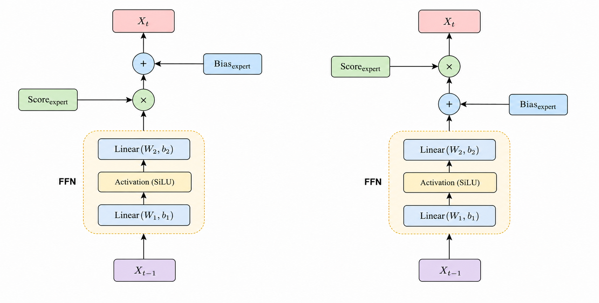

**Exact Linear Attention GPT**

| Inner bias | Outer bias | Without bias |
|:---:|:---:|:---:|
| 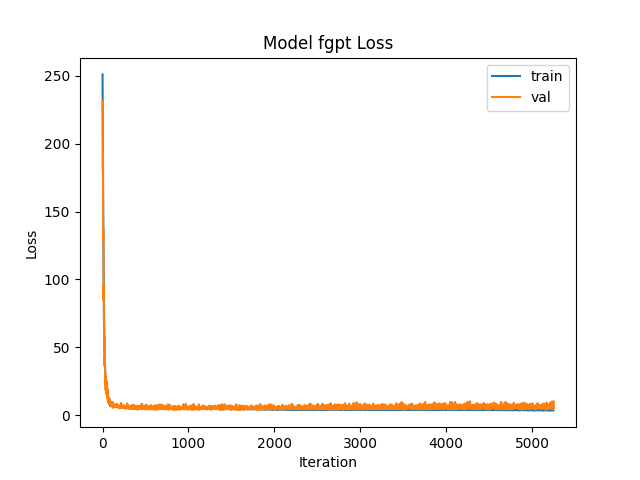 | 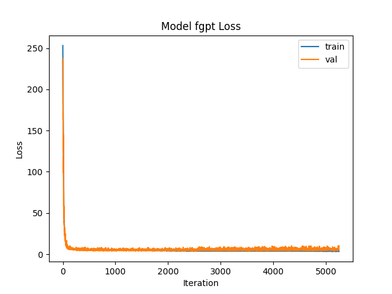 | 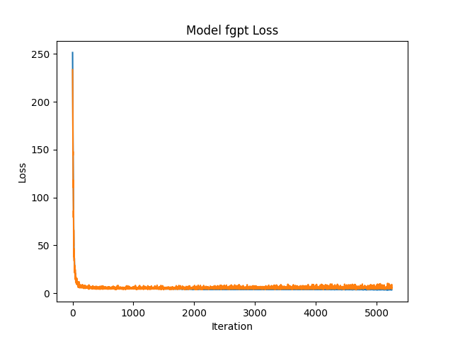 |

**Full Attention GPT**

| Inner bias | Outer bias | Without bias |
|:---:|:---:|:---:|
| 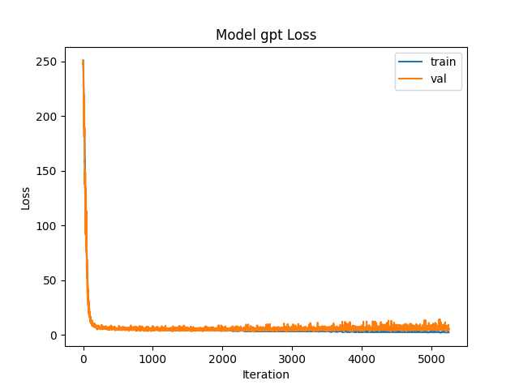 | 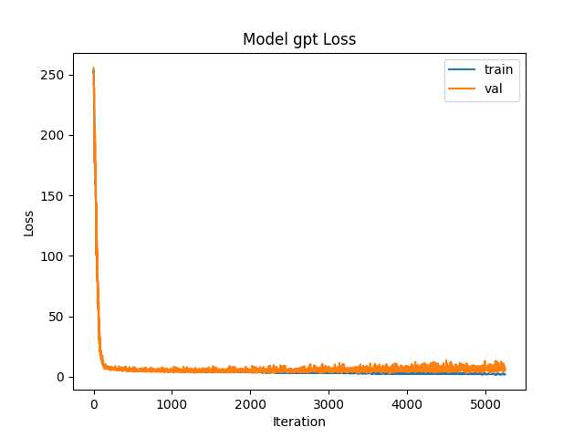 | 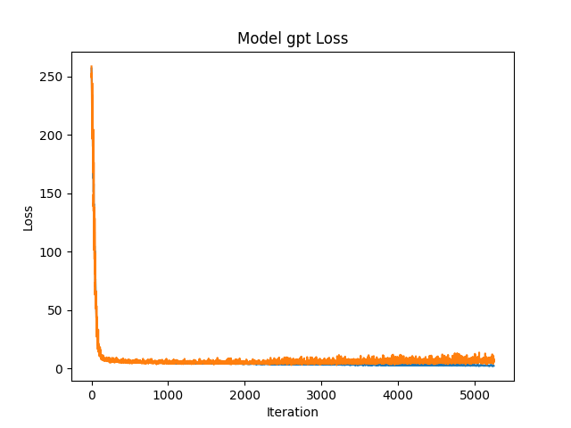 |

> **Figure:** Comparison of Exact Linear Attention GPT (top row) and Full Attention GPT (bottom row).

As for the issue of communication overhead, token dispatching based on routing scores is currently irreplaceable owing to the inherent nature of sparse activation. Nevertheless, cross-device transmission can be uniformly scheduled, analogous to the design of unified memory architecture [(Jia et al., 2020)](#ref-jia2020megatron). In fact, consecutive token blocks form semantic communities. **Partitioning tokens into blocks in a proper manner can substantially reduce communication overhead, compared with fine-grained routing conducted at the individual token level.**

### 5.2 Hyperlink-Based Residual Replacement for Degradation Eradication

Traditional residual connections across multiple Decoder layers suffer from gradient vanishing and difficult cross-layer information propagation. The current mainstream solutions to this issue are HC (Hyper-Connection) and mHC (Manifold-Constrained Hyper-Connection).

We propose to reconstruct the residual pathway itself: we establish residual connections between Decoder layers at different depths and remove the attention residual branch in the standard Pre-Norm architecture, treating the entire Transformer layer as an integrated whole. Furthermore, since modern FFNs are equipped with gated structures, the gated outputs can be naturally leveraged to adaptively modulate the signal of each layer.

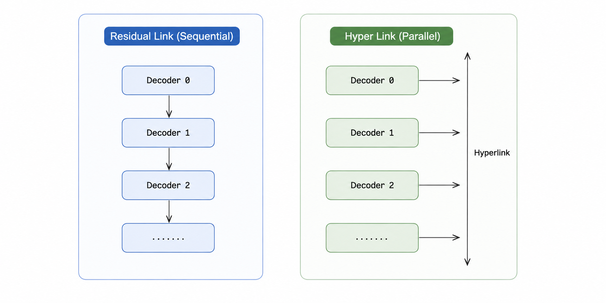

Experimental results demonstrate that our method can effectively accelerate training speed and substantially mitigate gradient degradation. Under identical computational overhead, Hyper-Link achieves faster convergence and better fitting performance than conventional Residual-Link. This also explains why the convergence curves in all experimental plots show an extremely steep initial drop followed by steady decline in the later stage.

**In the experiment, we removed the final normalization layer of GPT to accelerate convergence speed**. In practical cluster training, however, the final normalization is required to maintain model stability. For connections between hyperlinks under gated mechanisms, output normalization is unnecessary, as the gate itself modulates the output. In particular, for extremely large and diverse datasets containing tens of thousands of tokens with high semantic entropy in the corpus (spanning multiple domains), additional normalization (segmented normalization) is needed to sustain training stability.

| Hyper-Link | Normal |
|:---:|:---:|
|  | 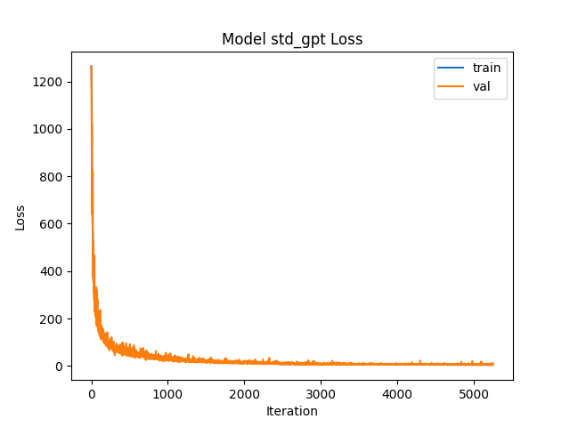 |

> **Figure:** Training Comparison (GPT)

### 5.3 How Memory Works

In general, human memory exists in two forms. The first is what we term **factual memory**, which records that a certain event has occurred. The second is **qualitative memory**, which represents how a given event is perceived or evaluated. This fundamental dichotomy of memory divides all known information into two categories: behavioral judgment and objective existence.

For factual memory, we typically regard it as background knowledge. Qualitative memory, by contrast, functions more like inherent constraints and rules. A simple example illustrates this point: suppose you dine at a restaurant one day and have a poor experience. Would you choose to visit again? Evidently, it is the **known judgment content** embedded in qualitative memory that guides your subsequent decision-making.

In conventional model training, this cognitive capability is entirely encapsulated within the Feed-Forward Network (FFN), forming an inexplicable black box where multiple conditional constraints are tightly coupled together. If we aim to explicitly disentangle factual memory from qualitative memory, we need to redesign the entire computational process from the perspective of semantic space transformation.

According to recent research by the DeepSeek team, the Engram [(Cheng et al., 2026)](#ref-cheng2026conditional) module performs remarkably well as an auxiliary component for knowledge storage, corresponding to factual memory. This raises a key question: how should we construct qualitative memory, which serves as the more critical behavioral guideline itself? Our answer to this is clearly: **Attention is all you need.**

Do you still remember that we mentioned earlier in Hyper-Link that **we removed the attention residual**? This is not merely to make the layer output act as a whole; instead, we have another ingenious application for it here.

If we perform discrete differentiation on the process $X_{k} \to X_{k-1}$, we can observe that:

$$X_{k} = DecoderLayer(X_{k-1})$$

$$\Delta X_{k|k-1} = X_{k} - X_{k-1} = ffn(attn(RMSnorm(X_{k-1})\,)\,)$$

We refer to the differential result $\Delta X_{k|k-1}$ as the "Flow" of the transformation $X_{k} \to X_{k-1}$. It serves as the "trajectory" of the semantic transformation process, i.e., an object that records how the semantics evolve after passing through the current layer. Then we design a bidirectional attention-based perception module for the "Flow" of this evolution process, which is formulated as follows:

- $Q \in \mathbb{R}^{D \times D}$ is flow's query representation, means "What about this transformation."
- $K \in \mathbb{R}^{D \times D}$ is flow's key representation, means "What I can provide for this transformation."
- $V \in \mathbb{R}^{D \times D}$ is flow's value representation, means "What I can do for this transformation."

**Pseudocode:**

```python
def lob(dx):
    q = Q(dx)
    k = K(dx)
    v = V(dx)
    # Bidirectional Linear Attention
    return = ELA(q, k, v)
...
def decoder(x):
    x_norm = norm(x)
    attn = ELA_causal(query=x_norm,
        key=x_norm,
        value=x_norm)
    ffn_out, aux_loss = MoE(attn)
    # get the flow query attention output
    lob_out = lob(ffn_out)
    # hyper-link
    return x + ffn_out + lob_out, aux_loss
```

> *For detailed implementation, please refer to our GitHub repository.*

With the above construction, we observe that the DecoderLayer equipped with the Transformation Flow comprehensively outperforms the vanilla version in training. Datasets that originally required 30 epochs for convergence only need around 10 epochs after integrating the memory module, and the training loss and validation loss become much more consistent.

In fact, this is a mathematical formulation of **qualitative memory**. The QKV weight matrices of bidirectional attention can "memorize" which representations lead to lower loss during training. Our input is the **layer-wise Transformation** itself, enabling the model to implicitly record the layer's processing experience through learning to serve subsequent generation.

Since the output of the FFN is produced by causal attention, it inherently possesses forward causal properties. Meanwhile, we require memory to query the transformation history of all positions, making this a global bidirectional attention query process.

Although this training process appears to adopt explicit supervised learning, it essentially leverages supervised learning to implement reinforcement learning. This is because the entire pipeline relies on parameterized memory content queried from layer Transformations to support final output, forming an implicit reinforcement learning paradigm—the "Action-Reward" mechanism: the current memory query serves as the **Action**, and its direct contribution to the loss acts as the corresponding **Reward**.

| Memory Lobe | Normal |
|:---:|:---:|
| 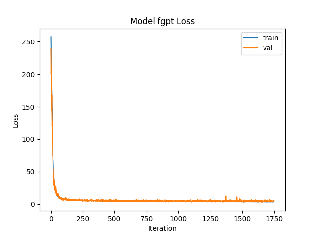 |  |

> **Figure:** Training Comparison (ELA GPT)

Furthermore, additionally, the QKV weight matrices of this memory module are pluggable. Theoretically, this framework can be embedded into any semantic-transformation-based model that is capable of producing $\Delta X_{k|k-1}$, allowing it to learn internal experience and form qualitative memory. This provides a brand-new paradigm for LLM training beyond **LoRA** and **Engram** methods.

In particular, the design inspiration of this module is derived from the principle of biological neural memory [(Polyn & Kahana, 2008)](#ref-polyn2008) [(Zhang et al., 2018)](#ref-zhang2018), where the prefrontal cortex plays a crucial role in the contextual integration of memory [(de Sousa et al., 2026)](#ref-desousa2026).

---

## 6. Experiments

**To unify the experimental variables, all attention kernels involved in the corresponding attention model adopt the same type.**

These two models are built for ablation validation. The training dataset contains 129×3500 samples, amounting to 451,500 tokens. We adopt the Minimind [(Gong, 2026)](#ref-jingyao2026) tokenizer with a vocabulary size of V=6400. The model architecture adopts L=4 Transformer layers, with a model dimension dmodel=256 and nheads=4 attention heads. A Mixture-of-Experts (MoE) module is further introduced with nexperts=4. The total number of model parameters is 5,838,864. Training with 30 epochs.

We separately train FA-GPT with standard MoE, as well as ELA-GPT variants equipped with the Hadamard Exp Kernel and the Summation Squared Euclidean Distance Kernel.

### 6.1 No Memory Training Comparison

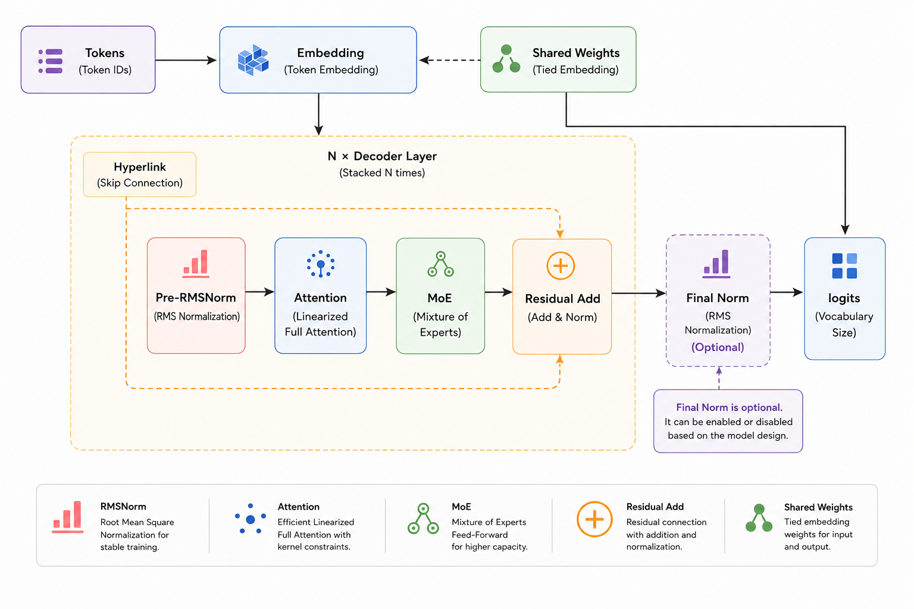

**Training Comparison (Hyper-Link)**

| $\|A_i+B_j\|^2$ | $\exp(A_i)\exp(B_j)$ | Full |
|:---:|:---:|:---:|
| 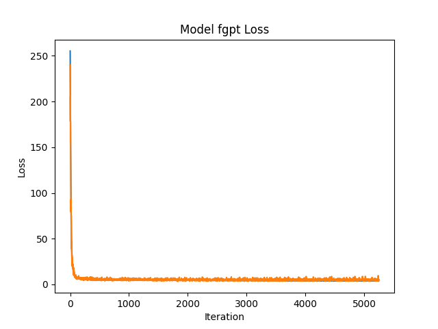 |  |  |

**Training Comparison (Normal)**

| $\|A_i+B_j\|^2$ | $\exp(A_i)\exp(B_j)$ | Full |
|:---:|:---:|:---:|
| 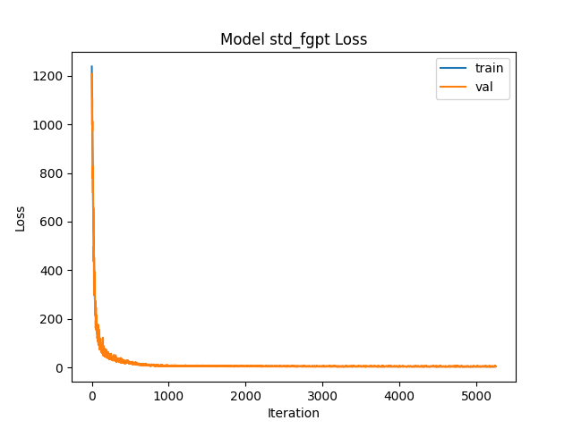 |  |  |

There it can be observed that the two models exhibit negligible differences in training performance. In particular, the ELA variant shows a slight advantage in anti-overfitting ability.

### 6.2 Memory Additional

In this comparative experiment, after integrating the Memory module, the model not only achieves faster loss convergence. On the vanilla GPT, we also observe an abrupt drop with an inflection point at around the 750th training step (counted as global steps, with 10 epochs totaling 1750 steps).

This is certainly not a sudden "grokking" of the model. Instead, the memory module comes into play and enables the model to capture underlying patterns. Given the relatively small scale of training tokens in our setup, the number of non-embedding parameters increases to 6,624,272 after introducing the memory module, allowing the model to directly reuse learned empirical regularities.

When a causal mask is applied to the Memory Query of the vanilla GPT, such abrupt performance drop vanishes completely.

These experimental results demonstrate that the proposed ELA exhibits excellent performance in anti-overfitting and generalization capability.

**Training Comparison (Hyper-Link & Memory)**

| $\exp(A_i)\exp(B_j)$ | Full | Full (mem-causal) |
|:---:|:---:|:---:|
|  | 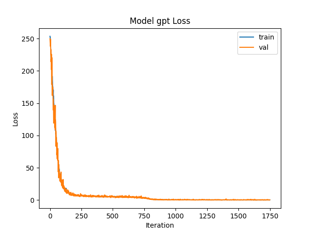 | 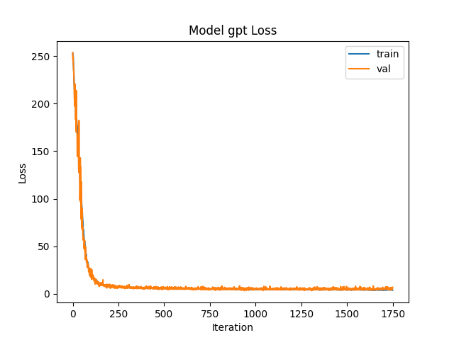 |

### 6.3 Long-range Training

In long-range training, ELA maintains stable convergence.

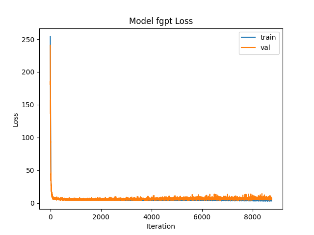

---

## 7. Extend to Vision Models

We reformulate deep convolutions in YOLO [(YOLO26)](#ref-yolo26) [(YOLOv8)](#ref-yolov8) with linear attention to build a model featuring fewer parameters and lower inference latency, which delivers outstanding performance on our benchmarks.

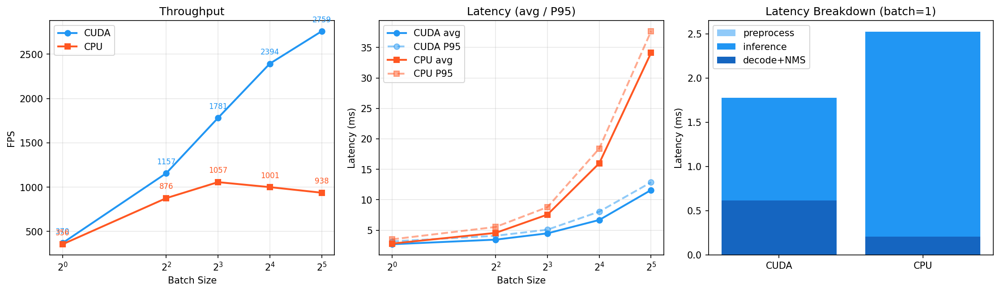

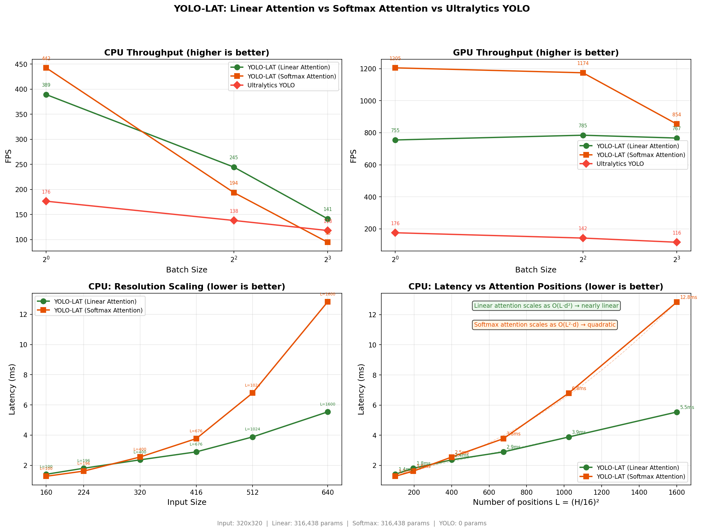

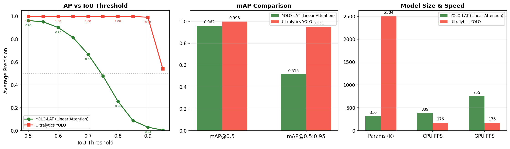

In comparative experiments, YOLO-LAT achieves **2.2× faster inference on CPU** and **4.3× faster inference on GPU** compared with vanilla YOLO [(YOLO26)](#ref-yolo26). In terms of model performance, our method obtains competitive accuracy with **7.9× fewer parameters**: YOLO-LAT reaches an mAP@0.5 of 0.962, close to YOLO's 0.998. Nevertheless, there exists a noticeable gap in mAP@0.5:0.95 (0.515 versus 0.951), indicating inferior bounding box localization precision.

We verify that this limitation stems from the lack of depth information. Traditional YOLO adopts CASC dynamic channel pruning [(YOLOv5)](#ref-yolov5) to simulate hierarchical visual perception. In contrast, YOLO-LAT leverages inherent attention mechanisms to focus on foreground objects without dedicated modules tailored for object detection. Such results sufficiently demonstrate the effectiveness of generalizing linear attention [(LinearViT)](#ref-linearvit) to visual models.

To further elaborate on the effects of Exact Linear Attention on Vision Transformer (ViT) models, we constructed a simplified object detection model based on FCOS [(Tian et al., 2019)](#ref-tian2019fcos). Given its excellent training performance, we adopted the results from 50 basic training epochs to prevent overfitting. In fact, the linear-complexity attention computation of Exact Linear Attention is particularly well-suited for pure vision models. Such models can natively derive the corresponding Q, K and V matrices via convolution operations and subsequently perform attention calculations on the entire image, which aligns with the human visual mechanism of focusing on specific targets.

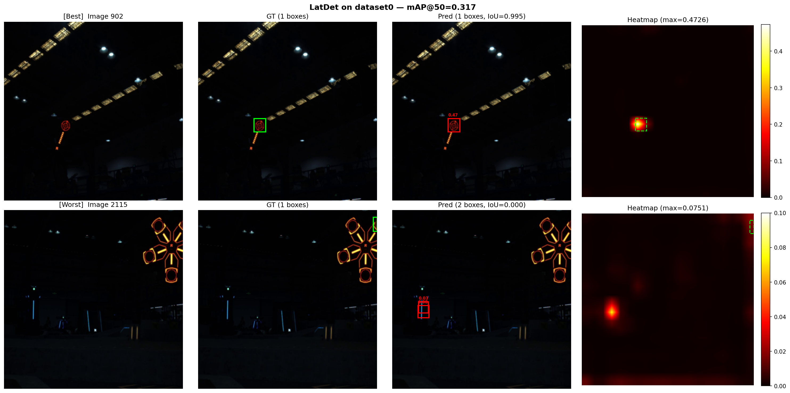

In future work, we will introduce vision-lidar fused images with native depth cues to train models equipped with inherent depth estimation capabilities. This paper preliminarily explores future development trends of visual models, and proposes a technical paradigm that compensates for the world understanding defects of world models via depth information estimation.

---

## 8. Exploratory Works

Subsequent work will further explore extended designs based on this paper.

- **Generalization to Diffusion Models**: leveraging infinitely long precise attention to globally perceive all fine-grained details and thereby boost generation quality.
- Explore decomposable kernel functions with properties closer to $e^{xy}$. (The current form of the kernel function is $e^{x+y}$.)
- Explore whether the memory module can break the limitations of scaling laws, enabling the model to achieve stronger performance with fewer parameters (e.g., by low-rank factorization of QK).
- Extend to full-modality world models.

All these endeavors are inseparable from our core insight: Exact Linear Attention.

---

## Acknowledgments

> I sincerely appreciate the anonymous reviewers and the associate editor for their valuable time, rigorous reviews, and insightful constructive comments. Their professional feedback and thoughtful suggestions have greatly helped refine the technical presentation, consolidate the logical framework, and substantially improve the overall quality of this manuscript.

作者感谢所有给予过帮助的朋友（排名不分先后）

- [mzwing (Lockinwize Lolite)](https://github.com/mzwing)
- [hibays (hibays)](https://github.com/hibays)
- .....

---

## References

1. <a id="ref-katharopoulos2020"></a>A. Katharopoulos, A. Vyas, N. Pappas, and F. Fleuret, "Transformers are RNNs: Fast autoregressive transformers with linear attention," in *Proc. 37th Int. Conf. Mach. Learn. (ICML)*, 2020, pp. 5156–5165.

2. <a id="ref-schlag2021"></a>I. Schlag, K. Irie, and J. Schmidhuber, "Linear transformers are secretly fast weight programmers," in *Proc. 38th Int. Conf. Mach. Learn. (ICML)*, 2021, pp. 9355–9366.

3. <a id="ref-qin2022"></a>Z. Qin, X. Han, W. Sun, D. Li, L. Kong, N. Barnes, and Y. Zhong, "The devil in linear transformer," in *Proc. Conf. Empirical Methods Natural Lang. Process. (EMNLP)*, 2022, pp. 7025–7041.

4. <a id="ref-vaswani2017"></a>A. Vaswani et al., "Attention is all you need," in *Proc. 31st Conf. Neural Inf. Process. Syst. (NeurIPS)*, 2017, pp. 5998–6008.

5. <a id="ref-jingyao2026"></a>Jingyao Gong, "MiniMind: Train a Tiny LLM from Scratch," GitHub: [https://github.com/jingyaogong/minimind](https://github.com/jingyaogong/minimind)

6. <a id="ref-cheng2026conditional"></a>Xin Cheng, Wangding Zeng, Damai Dai, Qinyu Chen, Bingxuan Wang, et al., "Conditional Memory via Scalable Lookup: A New Axis of Sparsity for Large Language Models," *arXiv preprint arXiv:2601.07372*, 2026.

7. <a id="ref-zhu2024hyper"></a>Defa Zhu, Hongzhi Huang, Zihao Huang, Yutao Zeng, Yunyao Mao, Banggu Wu, Qiyang Min, and Xun Zhou, "Hyper-Connections," *arXiv preprint arXiv:2409.19606*, 2024.

8. <a id="ref-xie2025mhc"></a>Zhenda Xie, Wentao Zhang, Xinyu Zhao, Yukai Li, Peng Wang, Weiran You, and others, "mHC: Manifold-Constrained Hyper-Connections," *arXiv preprint arXiv:2512.24880*, 2025.

9. <a id="ref-mercer1909"></a>J. Mercer, "Functions of positive and negative type, and their connection with the theory of integral equations," *Philosophical Transactions of the Royal Society of London. Series A, Containing Papers of a Mathematical or Physical Character*, vol. 209, pp. 415–446, 1909.

10. <a id="ref-minimax2025lightning"></a>MiniMax Team, "MiniMax-01: Scaling Foundation Models with Lightning Attention," *arXiv preprint arXiv:2501.08313*, 2025.

11. <a id="ref-kimilinear2025"></a>Kimi Team, "Kimi Linear: A Novel Hybrid Linear Attention Architecture," *arXiv preprint arXiv:2510.xxxxx*, 2025.

12. <a id="ref-jain2019attention"></a>S. Jain and B. C. Wallace, "Attention is not Explanation," in *Proc. Conf. North American Chapter of the Association for Computational Linguistics: Human Language Technologies (NAACL-HLT)*, 2019.

13. <a id="ref-jia2020megatron"></a>Z. Jia, W. Kwon, and O. Ruwase, "Efficient Large-Scale Language Model Training on GPU Clusters Using Megatron-LM," in *Proc. Int. Conf. High Performance Computing, Networking, Storage and Analysis (SC'20)*, 2020.

14. <a id="ref-buschman2010goal"></a>T. J. Buschman and E. K. Miller, "Goal-direction and top-down control," *Philosophical Transactions of the Royal Society B: Biological Sciences*, vol. 365, no. 1544, pp. 1271–1278, 2010.

15. <a id="ref-polyn2008"></a>Polyn, S. M., & Kahana, M. J., "Memory search and the neural representation of context," *Trends in Cognitive Sciences*, 12(1):24–30, 2008.

16. <a id="ref-zhang2018"></a>Zhang, W., van Ast, V. A., Klumpers, F., Roelofs, K., & Hermans, E. J., "Memory contextualization: The role of the left inferior frontal gyrus in binding event and contextual information," *Journal of Cognitive Neuroscience*, 30(5):698–713, 2018.

17. <a id="ref-desousa2026"></a>de Sousa, A. F., Zeidler, Z. E., Almeida-Filho, D. G., Shen, Y., Luchetti, A., Simanian, S., Mardini, M., DeNardo, L. A., & Silva, A. J., "The prefrontal cortex controls memory organization in the hippocampus," *Nature Neuroscience*, 29:1191–1202, 2026. doi: 10.1038/s41593-026-02231-1.

18. <a id="ref-yolov1"></a>J. Redmon, S. Divvala, R. Girshick, and A. Farhadi, "You only look once: Unified, real-time object detection," in *Proc. IEEE Conf. Comput. Vis. Pattern Recognit. (CVPR)*, 2016, pp. 779–788.

19. <a id="ref-yolov5"></a>Ultralytics, "YOLOv5: A state-of-the-art real-time object detection system," 2020. [Online]. Available: [https://github.com/ultralytics/yolov5](https://github.com/ultralytics/yolov5)

20. <a id="ref-yolov7"></a>C.-Y. Wang, A. Bochkovskiy, and H.-Y. M. Liao, "YOLOv7: Trainable bag-of-freebies sets new state-of-the-art for real-time object detectors," in *Proc. IEEE/CVF Conf. Comput. Vis. Pattern Recognit. (CVPR)*, 2023, pp. 7464–7475.

21. <a id="ref-yolov8"></a>Ultralytics, "YOLOv8: A new state-of-the-art computer vision model," 2023. [Online]. Available: [https://github.com/ultralytics/ultralytics](https://github.com/ultralytics/ultralytics)

22. <a id="ref-yolo12"></a>Ultralytics, "YOLO12: Attention-centric object detection," 2025. [Online]. Available: [https://docs.ultralytics.com/models/yolo12/](https://docs.ultralytics.com/models/yolo12/)

23. <a id="ref-yolo-dma"></a>Y. Li, Z. Wang, and H. Liu, "YOLO-DMA: A small-object detector based on multi-scale deformable convolution and linear attention," *Electronics*, vol. 15, no. 4, p. 812, 2026.

24. <a id="ref-yolo26"></a>G. Jocher and J. Qiu, "Ultralytics YOLO26," version 26.0.0, 2026. [Online]. Available: [https://github.com/ultralytics/ultralytics](https://github.com/ultralytics/ultralytics)

25. <a id="ref-linearvit"></a>C. Zheng, "The linear attention resurrection in vision transformer," *arXiv preprint arXiv:2501.16182*, 2025.

26. <a id="ref-tian2019fcos"></a>Z. Tian, C. Shen, H. Chen, and T. He, "FCOS: Fully convolutional one-stage object detection," in *Proc. IEEE/CVF Int. Conf. Comput. Vis. (ICCV)*, 2019, pp. 9627–9636, arXiv:1904.01355.
